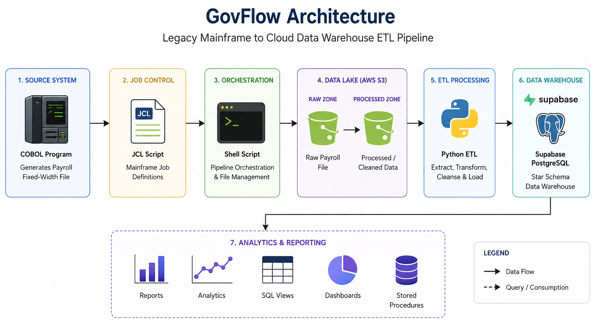
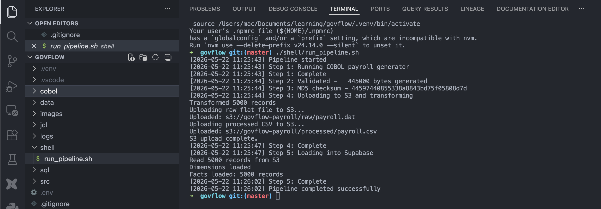
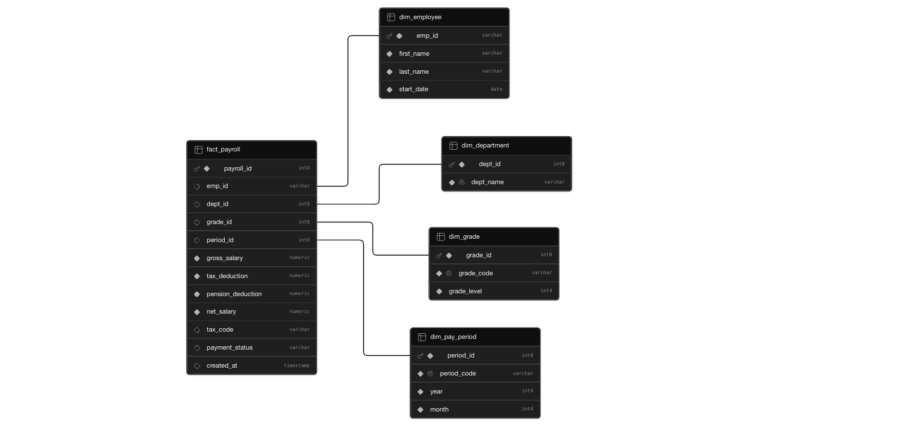
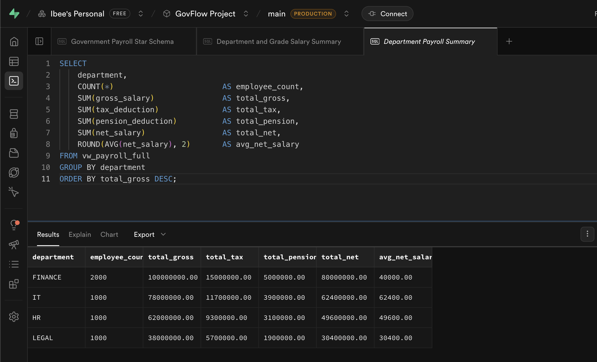
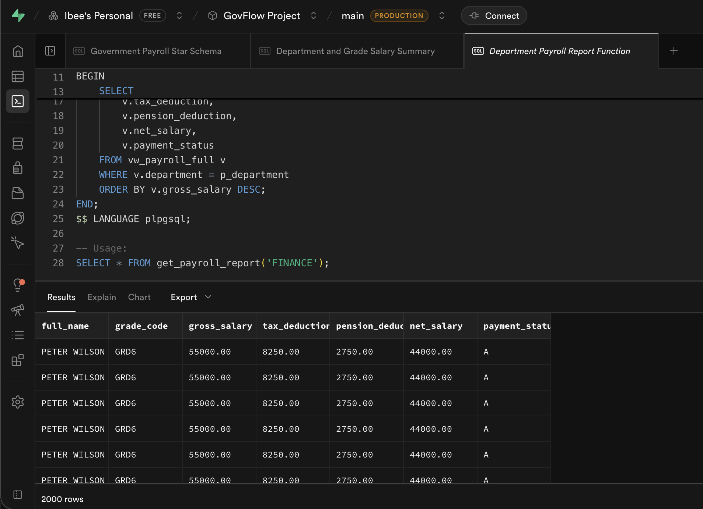

# GovFlow - Government Payroll ETL Pipeline

## The Story

Most government departments still run critical systems on mainframes. COBOL 
programs processing millions of payroll transactions daily, some untouched for 
decades. The challenge for modern data teams is not replacing these systems 
(that is expensive and risky), it is bridging them with modern infrastructure.

GovFlow simulates exactly that. A COBOL program plays the role of the mainframe 
source system, generating fixed-width payroll flat files the way real government 
systems do. From there, the data travels through a modern cloud pipeline, 
landing in AWS S3, transformed via Python ETL, and loaded into a PostgreSQL 
data warehouse built for analytics.

---

## Architecture



| Layer | Technology | Role |
|---|---|---|
| Source system | COBOL + GnuCOBOL | Generates fixed-width payroll flat file |
| Job control | JCL | Mainframe job definition (production reference) |
| Orchestration | Linux Shell Script | Runs and validates the full pipeline |
| Data lake | AWS S3 | Stores raw and processed files |
| ETL | Python | Parses, transforms, loads |
| Data warehouse | Supabase (PostgreSQL) | Star schema for analytics |
| Analytics | SQL | Views, window functions, stored procedures |

---

## Pipeline in Action



The shell script orchestrates the entire pipeline in a single command, 
mimicking how JCL automates job execution on a mainframe. Every step is 
timestamped and logged for auditability.

---

## Key Design Decisions

**Why COBOL?**
COBOL still processes an estimated $3 trillion in daily commerce globally. 
Government payroll systems are among the most common COBOL workloads. Writing 
the source system in COBOL makes this simulation authentic to how government 
data pipelines actually work.

**Why hardcoded data in COBOL?**
Real mainframe systems pull data from VSAM files or databases. Since this 
project runs without actual mainframe infrastructure, the COBOL program uses 
hardcoded employee templates and generates 5000 records via a loop, mimicking 
the output of a real payroll run.

**Why SEQUENTIAL over LINE SEQUENTIAL?**
Real mainframe files use fixed-block format (RECFM=FB), pure binary with no 
line endings. SEQUENTIAL matches that behaviour. LINE SEQUENTIAL adds newline 
characters which is a GnuCOBOL convenience for modern operating systems but 
not authentic to how mainframe files are structured.

**Why JCL if we cannot run it?**
JCL is included as a production reference. It documents exactly how this job 
would be submitted on a real IBM z/OS mainframe, including dataset definitions, 
record format, and failure handling. Any mainframe professional can read it and 
understand the job.

**Why keep raw files in S3?**
The raw flat file is preserved in S3 alongside the processed CSV. This follows 
the data lake pattern. You never discard source data. If transformation logic 
changes, you can reprocess from the raw file without going back to the source 
system.

**Why star schema?**
A star schema separates measurable facts (salary amounts) from descriptive 
context (employee, department, grade). This makes analytical queries faster 
and more flexible. Dimension tables are designed for easy extension. Adding 
a new grade or department is a single row insert, not a schema change.

---

## Data Warehouse Schema



```sql
dim_employee    -- who got paid
dim_department  -- which department
dim_grade       -- what grade level
dim_pay_period  -- when they got paid
fact_payroll    -- how much (the measurements)
```

---

## SQL Layer

### Departmental Payroll Summary


```sql
SELECT
    department,
    COUNT(*)                  AS employee_count,
    SUM(gross_salary)         AS total_gross,
    SUM(tax_deduction)        AS total_tax,
    SUM(net_salary)           AS total_net,
    ROUND(AVG(net_salary), 2) AS avg_net_salary
FROM vw_payroll_full
GROUP BY department
ORDER BY total_gross DESC;
```

### Payroll Report by Department (Stored Procedure)


```sql
SELECT * FROM get_payroll_report('FINANCE');
```

### Window Functions

```sql
-- Running payroll total by department
SELECT department, full_name, net_salary,
       SUM(net_salary) OVER (
           PARTITION BY department ORDER BY emp_id
       ) AS running_total
FROM vw_payroll_full;

-- Grade salary ranking
SELECT grade_code, grade_level,
       ROUND(AVG(gross_salary), 2) AS avg_gross,
       RANK() OVER (ORDER BY AVG(gross_salary) DESC) AS salary_rank
FROM vw_payroll_full
GROUP BY grade_code, grade_level;
```

---

## How to Run

### Prerequisites
- GnuCOBOL (`brew install gnucobol`)
- Python 3.12+ with `uv`
- AWS CLI configured with S3 access
- Supabase project with schema loaded from `sql/schema.sql`

### Run the full pipeline

```bash
./shell/run_pipeline.sh
```

This single command does the following:
1. Runs the COBOL payroll generator
2. Validates the output file
3. Generates an MD5 checksum for data integrity
4. Uploads raw and processed files to AWS S3
5. Loads data into the Supabase star schema

### Run a payroll report

```sql
SELECT * FROM get_payroll_report('FINANCE');
SELECT * FROM get_payroll_report('HR');
```

---

## Project Structure

```
govflow/
├── cobol/          <- COBOL payroll generator
├── jcl/            <- Mainframe job definitions
├── shell/          <- Pipeline orchestration script
├── src/etl/        <- Python ETL, S3 upload, Supabase loader
├── sql/            <- Schema, views, queries, stored procedures
├── images/         <- Architecture and schema diagrams
└── README.md
```